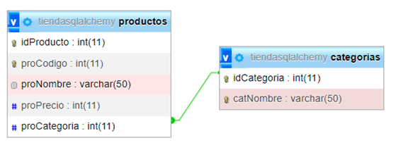

# **Uso del Framework Flask y Flask-SqlAlchemy**

# **Introducción**

**SQL Alchemy**
Es un kit de herramientas SQL y un ORM (Object Relational Mapper) que permite a las clases en Python asociarlas a tablas en bases de datos relacionales.

**SQLAlchemy**

- Es un kit de herramientas SQL que permite acceder a bases de datos relacionales.
- Permite realizar operaciones con los datos almacenados en la base de datos.
- Permite asociar clases en Python a tablas en bases de datos relacionales.
- Permite ejecutar consultas SQL mediante programación basada en objetos. 

# **Sentencias tipo SqlAlchemy para realizar operaciones a la base de datos**

- **Consultas todos los productos**: listaProductos = Producto.query.all()
- **Consultar un producto por su id**: Producto = Producto.query.get(idProducto)
- **Consultar un producto por Código**: Producto = Producto.query.filter_by(proCodigo = valor)
- **Agregar un producto a la base de datos**:
  
    p = Producto(proCodigo=10,proNombre=”xxx”,proPrecio=2323,proCategoria=1)
  
    db.session.add(p)
  
    db.session.commit()

- **Eliminar un producto de acuerdo a su id**:
  
    producto = Producto.query.get(idProducto)
  
    db.session.delete(producto)
  
    db.session.commit()

- **Actualizar un Producto**: Como ejemplo solo se actuliza el precio
  
    producto = Producto.query.get(idProducto)
  
    producto.proPrecio = 2400000
  
    db.session.commit()

  # **Aplicación Propuesta**

  Aplicación que realiza las **operaciones del CRUD** a una base de datos **SQL** utilizando la libreria **Flask-SqlAlchemy**.
  El código contiene las cadenas de conexión tanto para **mysql** o **sqlite**.
  
  **Base de Datos Propuesta para el Ejercicio**:
  
  

  **Librerias requeridas**
  - Flask
  - Flask-SQLALchemy
  - Pymysql (Para conexión a bases de datos mysql)
 
  **Requerimientos**
  - Agregar, consultar, actualizar y eliminar un Genero.
  - Agregar, consultar, actualizar y eliminar una Película
 
  **Rutas que se deben crear**

  - **/genero/: GET** ==> Retornar los generos existentes
  - **/genero/: POST** ==> Agregar un genero
  - **/genero/: PUT** ==> Actualizar un genero.
  - **/genero/: DELETE** ==> Eliminar un genero
  - **/pelicula/: GET** ==> Retornar las películas existentes
  - **/pelicula/: POST** ==> Agregar una película
  - **/pelicula/: PUT** ==> Actualizar una película
  - **/pelicula/: DELETE** ==> Eliminar una película
 
  # **Referencias**

  - Documentación oficial de Flask-SqlAlchemy: [Web Oficial](https://flask-sqlalchemy.readthedocs.io/en/stable/)
  - Tutorial en la web [Flask-SqlAlchemy](https://www.tutorialspoint.com/flask/flask_sqlalchemy.htm)
  - Sitio oficial del ORM SqlAlchemy.[Web Oficial](https://www.sqlalchemy.org/)
